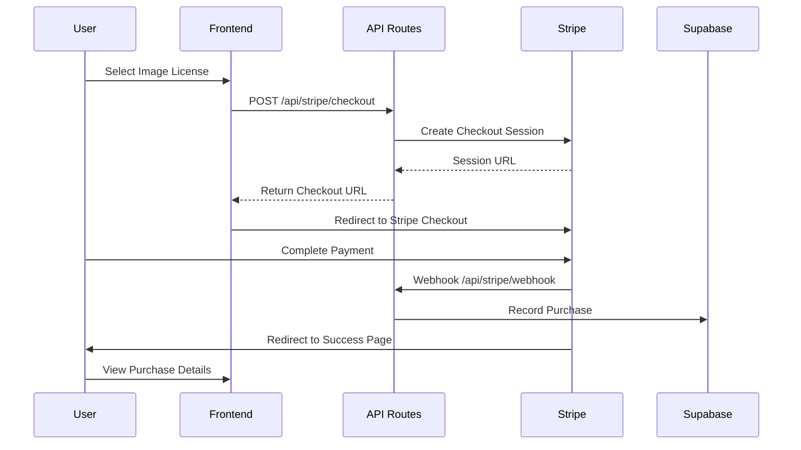
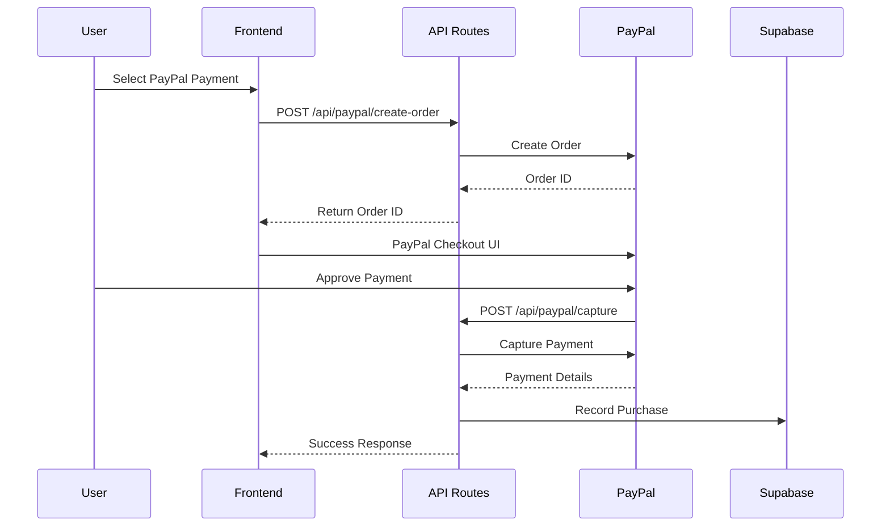
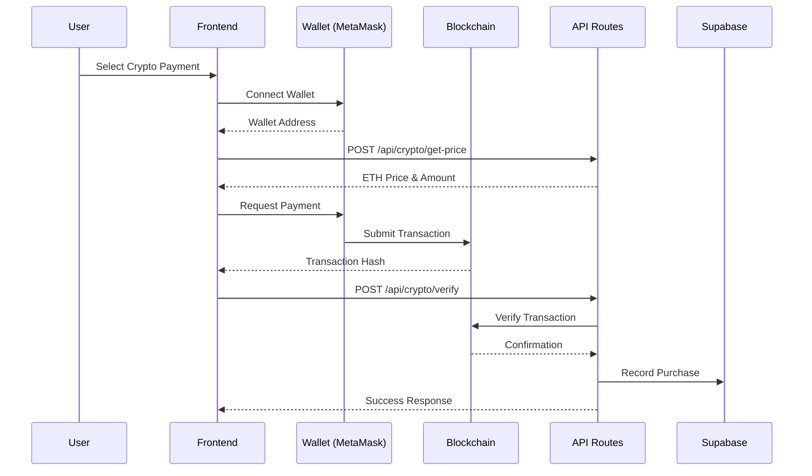

# Payment Integration Guide

## 📋 Overview

| Payment Method     | Status          | Complexity | Use Case                            |
| ------------------ | --------------- | ---------- | ----------------------------------- |
| **Stripe**         | ✅ Implemented  | Medium     | Credit/Debit Cards, Digital Wallets |
| **PayPal**         | 🔨 To Implement | Medium     | Alternative Payment Method          |
| **Cryptocurrency** | 🔨 To Implement | High       | Web3/Blockchain Payments            |

This document outlines the implementation and integration strategies for the **3 core widely-used payment methods** in your Next.js Supabase Gallery application.

---

## 🔥 1. Stripe Implementation (Current)

### Architecture Overview



### Current Implementation

#### Key Components:

- **Client Configuration**: `/src/lib/stripe.ts`
- **Checkout API**: `/src/app/api/stripe/checkout/route.ts`
- **Webhook Handler**: `/src/app/api/stripe/webhook/route.ts`
- **Purchase Details**: `/src/app/api/purchase/details/route.ts`

#### License Pricing Structure:

```typescript
const IMAGE_PRICE_CONFIG = {
  standard: { amount: 500, name: 'Standard License' }, // $5.00
  premium: { amount: 1500, name: 'Premium License' }, // $15.00
  commercial: { amount: 3000, name: 'Commercial License' }, // $30.00
}
```

#### Key Features:

- ✅ Secure webhook signature verification
- ✅ Automatic purchase recording in Supabase
- ✅ License type validation
- ✅ Session-based payment tracking
- ✅ Error handling and logging

---

## 💳 2. PayPal Integration (To Implement)

### Implementation Strategy

PayPal provides a widely-trusted alternative payment method, especially popular for users who prefer not to enter credit card details directly.

#### Required Dependencies:

```bash
npm install @paypal/react-paypal-js @paypal/paypal-js
```

#### Environment Variables:

```bash
# .env.local
PAYPAL_CLIENT_ID=your_paypal_client_id
PAYPAL_CLIENT_SECRET=your_paypal_client_secret
PAYPAL_ENVIRONMENT=sandbox # or production
```

### Architecture Flow



### Implementation Files Structure:

```
src/
├── components/
│   └── payment/
│       ├── paypal-button.tsx      # PayPal button component
│       └── payment-method-selector.tsx
├── app/api/
│   └── paypal/
│       ├── create-order/
│       │   └── route.ts           # Create PayPal order
│       ├── capture/
│       │   └── route.ts           # Capture payment
│       └── webhook/
│           └── route.ts           # PayPal webhooks
└── lib/
    └── paypal.ts                  # PayPal configuration
```

### Core Implementation:

#### PayPal Configuration:

```typescript
// src/lib/paypal.ts
const PAYPAL_BASE_URL =
  process.env.PAYPAL_ENVIRONMENT === 'production'
    ? 'https://api.paypal.com'
    : 'https://api.sandbox.paypal.com'

export async function getPayPalAccessToken() {
  const auth = Buffer.from(
    `${process.env.PAYPAL_CLIENT_ID}:${process.env.PAYPAL_CLIENT_SECRET}`
  ).toString('base64')

  const response = await fetch(`${PAYPAL_BASE_URL}/v1/oauth2/token`, {
    method: 'POST',
    headers: {
      'Content-Type': 'application/x-www-form-urlencoded',
      Authorization: `Basic ${auth}`,
    },
    body: 'grant_type=client_credentials',
  })

  const data = await response.json()
  return data.access_token
}

export { PAYPAL_BASE_URL }
```

#### PayPal Button Component:

```typescript
// src/components/payment/paypal-button.tsx
import { PayPalScriptProvider, PayPalButtons } from "@paypal/react-paypal-js";

interface PayPalButtonProps {
  imageId: string;
  licenseType: 'standard' | 'premium' | 'commercial';
  amount: number; // Amount in cents
}

export function PayPalButton({ imageId, licenseType, amount }: PayPalButtonProps) {
  const createOrder = () => {
    return fetch("/api/paypal/create-order", {
      method: "POST",
      headers: { "Content-Type": "application/json" },
      body: JSON.stringify({ imageId, licenseType, amount }),
    })
    .then(response => response.json())
    .then(order => order.id);
  };

  const onApprove = (data: any) => {
    return fetch("/api/paypal/capture", {
      method: "POST",
      headers: { "Content-Type": "application/json" },
      body: JSON.stringify({
        orderID: data.orderID,
        imageId,
        licenseType
      }),
    })
    .then(response => response.json())
    .then(details => {
      // Handle successful payment
      window.location.href = `/purchase/success?order_id=${data.orderID}`;
    });
  };

  const onError = (err: any) => {
    console.error('PayPal payment error:', err);
    // Handle error - show user-friendly message
  };

  return (
    <PayPalScriptProvider
      options={{
        clientId: process.env.NEXT_PUBLIC_PAYPAL_CLIENT_ID!,
        currency: "USD"
      }}
    >
      <PayPalButtons
        createOrder={createOrder}
        onApprove={onApprove}
        onError={onError}
        style={{
          layout: "vertical",
          color: "blue",
          shape: "rect",
          label: "paypal"
        }}
      />
    </PayPalScriptProvider>
  );
}
```

#### PayPal API Routes:

```typescript
// src/app/api/paypal/create-order/route.ts
import { NextRequest, NextResponse } from 'next/server'
import { getPayPalAccessToken, PAYPAL_BASE_URL } from '@/lib/paypal'

export async function POST(request: NextRequest) {
  try {
    const { imageId, licenseType, amount } = await request.json()
    const accessToken = await getPayPalAccessToken()

    const order = await fetch(`${PAYPAL_BASE_URL}/v2/checkout/orders`, {
      method: 'POST',
      headers: {
        'Content-Type': 'application/json',
        Authorization: `Bearer ${accessToken}`,
      },
      body: JSON.stringify({
        intent: 'CAPTURE',
        purchase_units: [
          {
            amount: {
              currency_code: 'USD',
              value: (amount / 100).toString(), // Convert cents to dollars
            },
            custom_id: `${imageId}-${licenseType}`,
            description: `${licenseType} license for image ${imageId}`,
          },
        ],
        application_context: {
          return_url: `${process.env.NEXT_PUBLIC_BASE_URL}/purchase/success`,
          cancel_url: `${process.env.NEXT_PUBLIC_BASE_URL}/purchase/cancelled`,
        },
      }),
    })

    const orderData = await order.json()

    if (!order.ok) {
      return NextResponse.json(
        { error: 'Failed to create PayPal order' },
        { status: 500 }
      )
    }

    return NextResponse.json(orderData)
  } catch (error) {
    console.error('PayPal order creation error:', error)
    return NextResponse.json(
      { error: 'Internal server error' },
      { status: 500 }
    )
  }
}
```

```typescript
// src/app/api/paypal/capture/route.ts
import { NextRequest, NextResponse } from 'next/server'
import { getPayPalAccessToken, PAYPAL_BASE_URL } from '@/lib/paypal'
import { createServerSupabaseClient } from '@/lib/supabase'

export async function POST(request: NextRequest) {
  try {
    const { orderID, imageId, licenseType } = await request.json()
    const accessToken = await getPayPalAccessToken()

    // Capture the payment
    const capture = await fetch(
      `${PAYPAL_BASE_URL}/v2/checkout/orders/${orderID}/capture`,
      {
        method: 'POST',
        headers: {
          'Content-Type': 'application/json',
          Authorization: `Bearer ${accessToken}`,
        },
      }
    )

    const captureData = await capture.json()

    if (!capture.ok || captureData.status !== 'COMPLETED') {
      return NextResponse.json(
        { error: 'Payment capture failed' },
        { status: 400 }
      )
    }

    // Record purchase in database
    const supabase = await createServerSupabaseClient()
    const { error } = await supabase.from('purchases').insert({
      image_id: imageId,
      license_type: licenseType,
      amount_paid: parseFloat(
        captureData.purchase_units[0].payments.captures[0].amount.value
      ),
      currency: 'USD',
      external_order_id: orderID,
      payment_method: 'paypal',
      payment_status: 'completed',
      created_at: new Date().toISOString(),
    })

    if (error) {
      console.error('Database error:', error)
      return NextResponse.json(
        { error: 'Failed to record purchase' },
        { status: 500 }
      )
    }

    return NextResponse.json({ success: true, captureData })
  } catch (error) {
    console.error('PayPal capture error:', error)
    return NextResponse.json(
      { error: 'Internal server error' },
      { status: 500 }
    )
  }
}
```

---

## 🪙 3. Cryptocurrency Integration (To Implement)

### Implementation Strategy

Cryptocurrency payments provide a decentralized payment option, particularly appealing to tech-savvy users and those in regions with limited traditional payment access.

#### Supported Cryptocurrencies:

- **Ethereum (ETH)** - Primary
- **USDC** - Stablecoin option
- **Bitcoin (BTC)** - Advanced implementation

#### Required Dependencies:

```bash
npm install ethers @metamask/sdk wagmi viem @tanstack/react-query
```

#### Environment Variables:

```bash
# .env.local
ETHEREUM_RPC_URL=https://mainnet.infura.io/v3/your_project_id
NEXT_PUBLIC_PAYMENT_WALLET_ADDRESS=0x...
NEXT_PUBLIC_CHAIN_ID=1 # 1 for mainnet, 11155111 for sepolia testnet
CRYPTO_EXCHANGE_API_KEY=your_coingecko_api_key
```

### Architecture Flow



### Implementation Structure:

```
src/
├── components/
│   └── payment/
│       ├── crypto-wallet-connect.tsx
│       ├── crypto-payment-form.tsx
│       └── transaction-status.tsx
├── app/api/
│   └── crypto/
│       ├── get-price/
│       │   └── route.ts
│       ├── verify/
│       │   └── route.ts
│       └── webhook/
│           └── route.ts
├── lib/
│   └── crypto/
│       ├── web3-config.ts
│       └── price-utils.ts
└── hooks/
    ├── use-wallet.ts
    └── use-crypto-payment.ts
```

### Core Implementation:

#### Web3 Configuration:

```typescript
// src/lib/crypto/web3-config.ts
import { createConfig, http } from 'wagmi'
import { mainnet, sepolia } from 'wagmi/chains'
import { injected, metaMask } from 'wagmi/connectors'

export const config = createConfig({
  chains: [mainnet, sepolia],
  connectors: [injected(), metaMask()],
  transports: {
    [mainnet.id]: http(process.env.ETHEREUM_RPC_URL),
    [sepolia.id]: http(
      `https://sepolia.infura.io/v3/${process.env.INFURA_PROJECT_ID}`
    ),
  },
})

export const PAYMENT_WALLET_ADDRESS = process.env
  .NEXT_PUBLIC_PAYMENT_WALLET_ADDRESS as `0x${string}`
export const CHAIN_ID = parseInt(process.env.NEXT_PUBLIC_CHAIN_ID || '1')
```

#### Wallet Connection Hook:

```typescript
// src/hooks/use-wallet.ts
import { useAccount, useConnect, useDisconnect } from 'wagmi'
import { metaMask } from 'wagmi/connectors'

export function useWallet() {
  const { address, isConnected } = useAccount()
  const { connect } = useConnect()
  const { disconnect } = useDisconnect()

  const connectWallet = () => {
    connect({ connector: metaMask() })
  }

  return {
    account: address,
    isConnected,
    connectWallet,
    disconnect,
  }
}
```

#### Price Utilities:

```typescript
// src/lib/crypto/price-utils.ts
export async function getEthPrice(): Promise<number> {
  try {
    const response = await fetch(
      'https://api.coingecko.com/api/v3/simple/price?ids=ethereum&vs_currencies=usd',
      {
        headers: {
          'X-CG-Demo-API-Key': process.env.CRYPTO_EXCHANGE_API_KEY || '',
        },
      }
    )
    const data = await response.json()
    return data.ethereum.usd
  } catch (error) {
    console.error('Failed to fetch ETH price:', error)
    throw new Error('Unable to fetch current ETH price')
  }
}

export function convertUsdToEth(usdAmount: number, ethPrice: number): string {
  const ethAmount = usdAmount / ethPrice
  return ethAmount.toFixed(6)
}
```

#### Crypto Payment Component:

```typescript
// src/components/payment/crypto-payment-form.tsx
import { useState, useEffect } from 'react'
import { useWallet } from '@/hooks/use-wallet'
import { useSendTransaction, useWaitForTransactionReceipt } from 'wagmi'
import { parseEther } from 'viem'
import { PAYMENT_WALLET_ADDRESS } from '@/lib/crypto/web3-config'

interface CryptoPaymentFormProps {
  imageId: string
  licenseType: 'standard' | 'premium' | 'commercial'
  amountUSD: number
}

export function CryptoPaymentForm({ imageId, licenseType, amountUSD }: CryptoPaymentFormProps) {
  const { account, isConnected, connectWallet } = useWallet()
  const [ethPrice, setEthPrice] = useState<number | null>(null)
  const [ethAmount, setEthAmount] = useState<string>('')
  const [isLoading, setIsLoading] = useState(false)

  const { data: hash, sendTransaction } = useSendTransaction()

  const { isLoading: isConfirming, isSuccess: isConfirmed } =
    useWaitForTransactionReceipt({ hash })

  useEffect(() => {
    fetchEthPrice()
  }, [])

  const fetchEthPrice = async () => {
    try {
      const response = await fetch('/api/crypto/get-price')
      const data = await response.json()
      setEthPrice(data.ethPrice)
      setEthAmount(data.ethAmount)
    } catch (error) {
      console.error('Failed to fetch ETH price:', error)
    }
  }

  const handlePayment = async () => {
    if (!isConnected || !ethAmount) return

    setIsLoading(true)
    try {
      sendTransaction({
        to: PAYMENT_WALLET_ADDRESS,
        value: parseEther(ethAmount),
        data: `0x${Buffer.from(`${imageId}-${licenseType}`).toString('hex')}`,
      })
    } catch (error) {
      console.error('Payment failed:', error)
      setIsLoading(false)
    }
  }

  useEffect(() => {
    if (isConfirmed && hash) {
      // Verify transaction on backend
      fetch('/api/crypto/verify', {
        method: 'POST',
        headers: { 'Content-Type': 'application/json' },
        body: JSON.stringify({
          txHash: hash,
          imageId,
          licenseType,
          amount: ethAmount,
        }),
      }).then(() => {
        window.location.href = `/purchase/success?tx=${hash}`
      })
    }
  }, [isConfirmed, hash])

  if (!isConnected) {
    return (
      <div className="crypto-payment-connect">
        <h3>Connect Your Wallet</h3>
        <p>Connect your MetaMask wallet to pay with Ethereum</p>
        <button onClick={connectWallet} className="btn-connect-wallet">
          Connect MetaMask
        </button>
      </div>
    )
  }

  return (
    <div className="crypto-payment-form">
      <div className="wallet-info">
        <p><strong>Connected:</strong> {account?.slice(0, 6)}...{account?.slice(-4)}</p>
      </div>

      <div className="payment-details">
        <div className="amount-display">
          <div className="usd-amount">
            ${(amountUSD / 100).toFixed(2)} USD
          </div>
          <div className="eth-amount">
            {ethAmount} ETH
            {ethPrice && (
              <span className="eth-price">
                (1 ETH = ${ethPrice.toFixed(2)})
              </span>
            )}
          </div>
        </div>

        <button
          onClick={handlePayment}
          disabled={isLoading || isConfirming || !ethAmount}
          className="btn-pay-crypto"
        >
          {isLoading || isConfirming
            ? 'Processing...'
            : `Pay ${ethAmount} ETH`
          }
        </button>

        {isConfirming && (
          <div className="transaction-status">
            <p>Transaction submitted! Waiting for confirmation...</p>
            {hash && (
              <a
                href={`https://etherscan.io/tx/${hash}`}
                target="_blank"
                rel="noopener noreferrer"
              >
                View on Etherscan
              </a>
            )}
          </div>
        )}
      </div>
    </div>
  )
}
```

#### Crypto API Routes:

```typescript
// src/app/api/crypto/get-price/route.ts
import { NextRequest, NextResponse } from 'next/server'
import { getEthPrice, convertUsdToEth } from '@/lib/crypto/price-utils'

export async function POST(request: NextRequest) {
  try {
    const { amountUSD } = await request.json()

    const ethPrice = await getEthPrice()
    const ethAmount = convertUsdToEth(amountUSD / 100, ethPrice) // Convert cents to dollars

    return NextResponse.json({
      ethPrice,
      ethAmount,
      usdAmount: amountUSD / 100,
    })
  } catch (error) {
    console.error('Price fetch error:', error)
    return NextResponse.json(
      { error: 'Failed to fetch current prices' },
      { status: 500 }
    )
  }
}
```

```typescript
// src/app/api/crypto/verify/route.ts
import { NextRequest, NextResponse } from 'next/server'
import { createPublicClient, http } from 'viem'
import { mainnet } from 'viem/chains'
import { createServerSupabaseClient } from '@/lib/supabase'
import { PAYMENT_WALLET_ADDRESS } from '@/lib/crypto/web3-config'

const publicClient = createPublicClient({
  chain: mainnet,
  transport: http(process.env.ETHEREUM_RPC_URL),
})

export async function POST(request: NextRequest) {
  try {
    const { txHash, imageId, licenseType, amount } = await request.json()

    // Get transaction details
    const transaction = await publicClient.getTransaction({
      hash: txHash as `0x${string}`,
    })

    const receipt = await publicClient.getTransactionReceipt({
      hash: txHash as `0x${string}`,
    })

    // Verify transaction
    if (receipt.status !== 'success') {
      return NextResponse.json({ error: 'Transaction failed' }, { status: 400 })
    }

    // Verify payment address
    if (
      transaction.to?.toLowerCase() !== PAYMENT_WALLET_ADDRESS.toLowerCase()
    ) {
      return NextResponse.json(
        { error: 'Invalid recipient address' },
        { status: 400 }
      )
    }

    // Record purchase in database
    const supabase = await createServerSupabaseClient()
    const { error } = await supabase.from('purchases').insert({
      image_id: imageId,
      license_type: licenseType,
      amount_paid: parseFloat(amount),
      currency: 'ETH',
      transaction_hash: txHash,
      payment_method: 'cryptocurrency',
      payment_status: 'completed',
      blockchain_network: 'ethereum',
      created_at: new Date().toISOString(),
    })

    if (error) {
      console.error('Database error:', error)
      return NextResponse.json(
        { error: 'Failed to record purchase' },
        { status: 500 }
      )
    }

    return NextResponse.json({ success: true })
  } catch (error) {
    console.error('Transaction verification error:', error)
    return NextResponse.json({ error: 'Verification failed' }, { status: 500 })
  }
}
```

---

## 🔧 Payment Method Integration

### Payment Method Selector

```typescript
// src/components/payment/payment-method-selector.tsx
import { useState } from 'react'
import { PayPalButton } from './paypal-button'
import { CryptoPaymentForm } from './crypto-payment-form'

interface PaymentMethodSelectorProps {
  imageId: string
  licenseType: 'standard' | 'premium' | 'commercial'
  amount: number
}

export function PaymentMethodSelector({ imageId, licenseType, amount }: PaymentMethodSelectorProps) {
  const [selectedMethod, setSelectedMethod] = useState<'stripe' | 'paypal' | 'crypto'>('stripe')

  const methods = [
    { id: 'stripe' as const, label: '💳 Credit Card', available: true },
    { id: 'paypal' as const, label: '🅿️ PayPal', available: true },
    { id: 'crypto' as const, label: '🪙 Cryptocurrency', available: true },
  ]

  return (
    <div className="payment-method-selector">
      <div className="method-tabs">
        {methods.map((method) => (
          <button
            key={method.id}
            className={`method-tab ${selectedMethod === method.id ? 'active' : ''} ${
              !method.available ? 'disabled' : ''
            }`}
            onClick={() => method.available && setSelectedMethod(method.id)}
            disabled={!method.available}
          >
            {method.label}
          </button>
        ))}
      </div>

      <div className="payment-form">
        {selectedMethod === 'stripe' && (
          <div className="stripe-form">
            {/* Your existing Stripe checkout component */}
            <p>Stripe checkout will be implemented here using your existing components</p>
          </div>
        )}

        {selectedMethod === 'paypal' && (
          <PayPalButton
            imageId={imageId}
            licenseType={licenseType}
            amount={amount}
          />
        )}

        {selectedMethod === 'crypto' && (
          <CryptoPaymentForm
            imageId={imageId}
            licenseType={licenseType}
            amountUSD={amount}
          />
        )}
      </div>
    </div>
  )
}
```

---

## 🗄️ Database Schema Updates

### Required Database Changes

```sql
-- Add new columns to purchases table
ALTER TABLE purchases
ADD COLUMN payment_method VARCHAR(20) DEFAULT 'stripe',
ADD COLUMN transaction_hash VARCHAR(255),
ADD COLUMN blockchain_network VARCHAR(50),
ADD COLUMN external_order_id VARCHAR(255); -- For PayPal order IDs

-- Create indexes for performance
CREATE INDEX idx_purchases_transaction_hash ON purchases(transaction_hash);
CREATE INDEX idx_purchases_payment_method ON purchases(payment_method);
CREATE INDEX idx_purchases_external_order_id ON purchases(external_order_id);

-- Update existing records to have payment_method = 'stripe'
UPDATE purchases SET payment_method = 'stripe' WHERE payment_method IS NULL;
```

### Updated Purchase Type Definition

```typescript
// src/types/purchase.ts
export interface Purchase {
  id: string
  image_id: string
  license_type: 'standard' | 'premium' | 'commercial'
  amount_paid: number
  currency: string
  payment_method: 'stripe' | 'paypal' | 'cryptocurrency'
  payment_status: 'pending' | 'completed' | 'failed' | 'cancelled'
  transaction_hash?: string
  blockchain_network?: string
  external_order_id?: string
  created_at: string
  updated_at: string
}
```

---

## 🌍 Environment Variables Setup

### Complete Environment Configuration

```bash
# .env.local

# Stripe (existing)
STRIPE_SECRET_KEY=sk_test_...
NEXT_PUBLIC_STRIPE_PUBLISHABLE_KEY=pk_test_...
STRIPE_WEBHOOK_SECRET=whsec_...

# PayPal
PAYPAL_CLIENT_ID=your_paypal_client_id
PAYPAL_CLIENT_SECRET=your_paypal_client_secret
PAYPAL_ENVIRONMENT=sandbox
NEXT_PUBLIC_PAYPAL_CLIENT_ID=your_paypal_client_id

# Cryptocurrency
ETHEREUM_RPC_URL=https://mainnet.infura.io/v3/your_project_id
NEXT_PUBLIC_PAYMENT_WALLET_ADDRESS=0x...
NEXT_PUBLIC_CHAIN_ID=1
CRYPTO_EXCHANGE_API_KEY=your_coingecko_api_key

# Application
NEXT_PUBLIC_BASE_URL=http://localhost:3000
```

---

## 🚀 Implementation Roadmap

### Phase 1: PayPal Integration (Recommended First)

1. **Setup PayPal Developer Account**

   - Create sandbox application
   - Generate client credentials
   - Configure webhook endpoints

2. **Implement PayPal Components**

   - Install PayPal SDK dependencies
   - Create PayPal button component
   - Build API routes for order creation and capture

3. **Integration & Testing**
   - Add PayPal option to payment selector
   - Test with sandbox credentials
   - Verify database recording

### Phase 2: Cryptocurrency Integration

1. **Web3 Infrastructure Setup**

   - Configure Ethereum RPC provider
   - Set up price feed integration
   - Create payment wallet

2. **Implement Crypto Components**

   - Install Web3 dependencies
   - Build wallet connection interface
   - Create payment flow components

3. **Security & Testing**
   - Implement transaction verification
   - Test on testnets (Sepolia)
   - Add proper error handling

### Phase 3: Enhancement & Production

1. **Enhanced User Experience**

   - Add payment method preferences
   - Implement retry mechanisms
   - Add transaction status tracking

2. **Analytics & Monitoring**

   - Track payment method usage
   - Monitor transaction success rates
   - Set up alerts for failed payments

3. **Production Deployment**
   - Switch to production credentials
   - Configure mainnet for crypto
   - Implement comprehensive testing

---

## 🔒 Security Considerations

### Payment Security Checklist

#### Stripe (Current)

- ✅ PCI DSS compliant
- ✅ Webhook signature verification
- ✅ Secure API key management

#### PayPal (To Implement)

- 🔲 Sandbox testing completed
- 🔲 Webhook signature verification
- 🔲 Order validation on capture
- 🔲 Production credentials secured

#### Cryptocurrency (To Implement)

- 🔲 Private key security (hardware wallet recommended)
- 🔲 Transaction amount verification
- 🔲 Network congestion handling
- 🔲 MEV protection considerations

### General Security Practices

- Environment variables properly secured
- API endpoints protected with proper validation
- Database queries use parameterized statements
- Error messages don't expose sensitive information
- Rate limiting implemented on payment endpoints

---

## 🧪 Testing Strategy

### Test Scenarios for Each Payment Method

#### PayPal Testing

```bash
# PayPal sandbox test accounts
Buyer: sb-buyer@business.example.com
Seller: sb-seller@business.example.com

# Test cards for different scenarios
# Successful payment, declined card, insufficient funds
```

#### Cryptocurrency Testing

```bash
# Ethereum Testnets
Sepolia Testnet Chain ID: 11155111
Sepolia ETH Faucet: https://sepoliafaucet.com/

# Test scenarios
# Successful transaction, insufficient gas, wrong network
```

### Automated Testing

```typescript
// Example test for PayPal integration
describe('PayPal Integration', () => {
  it('should create PayPal order successfully', async () => {
    const response = await fetch('/api/paypal/create-order', {
      method: 'POST',
      headers: { 'Content-Type': 'application/json' },
      body: JSON.stringify({
        imageId: 'test-image-123',
        licenseType: 'standard',
        amount: 500,
      }),
    })

    const data = await response.json()
    expect(response.ok).toBe(true)
    expect(data.id).toBeDefined()
    expect(data.status).toBe('CREATED')
  })
})
```

---

This comprehensive implementation guide provides everything needed to expand your gallery's payment capabilities beyond Stripe to include PayPal and cryptocurrency payments, focusing on the **3 core widely-used payment methods** as requested. The documentation includes complete code examples, security considerations, and a clear implementation roadmap.


## Popular Payment Service Providers

Popular payment service providers and gateways supporting these methods include:

	•	Stripe: Supports credit/debit cards, digital wallets, bank transfers, subscription billing, and multi-currency payments.
	•	PayPal: Known for wallet payments and BNPL options, widely trusted and accepted globally.
	•	Google Pay and Apple Pay: Leading digital wallets with biometric and mobile payment integration.
	•	Amazon Pay: Streamlined checkout using Amazon account payment methods.
	•	Authorize.net, Braintree, Helcim, Square, Adyen: Other notable gateways offering various payment method support and features for different business sizes and needs.

In summary, to optimize a web app shopping experience in 2025, offering a combination of credit/debit cards, major digital wallets (Apple Pay, Google Pay, PayPal), and bank transfer options is recommended to cover the majority of customer preferences and regions.
