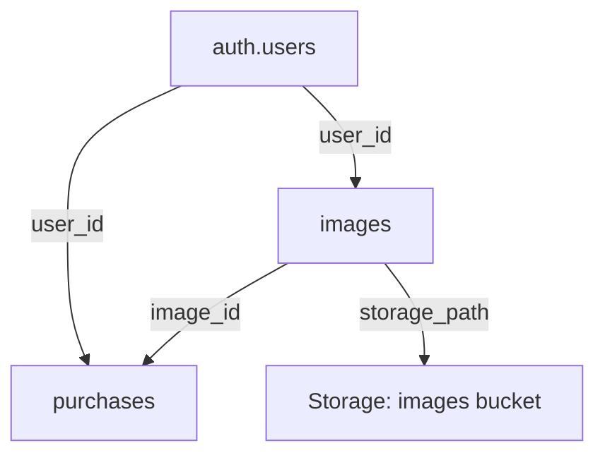

## 🔧 Supabase + Prisma ?

### ❌ No, this app does NOT need Prisma ❌

- Direct Supabase Client Usage (@spabase/supabase-js)
- Database Schema Management (create_images_table.sql...)
- Type Safety with TypeScript
- `prisma` is an ORM for `PostgreSQL`, it would be Redundant in this app

## 🚀 Supabase

Supabase is a cloud service that provides a full stack of tools for building web applications, including authentication, storage, and databases.

## 🔐 Auth: Where Login/Signup Info is Stored in Supabase

User authentication information is stored in Supabase's built-in authentication system: `auth.users`

## 🗄️ Database Tables

### 1️⃣ **`auth.users`** (Supabase Built-in)

- **Purpose**: User authentication and account management
- **Schema**: Managed by Supabase
- **Key Fields**:
  - `id` (UUID) - Primary key, referenced by other tables
  - `email` - User's email address
  - `encrypted_password` - Securely hashed password
  - `email_confirmed_at` - Email verification timestamp
  - `created_at`, `updated_at` - Account timestamps
  - `raw_user_meta_data` - Additional user metadata
- **RLS**: Managed by Supabase auth system

### 2️⃣ **`public.images`** (Custom Table)

### 3️⃣ **`public.purchases`** (Custom Table)

### 📁 Storage Buckets

### 1️⃣ **`images`** Bucket

- **Purpose**: Store actual image files
- **Configuration**: Created via migration `20240528000002_create_storage_policies.sql`
- **Settings**:
  - `public: true` - Allows public access to images
  - `fileSizeLimit: 5MB` - Maximum file size per upload
- **Storage Structure**:
  ```
  images/
  ├── {user_id}/
  │   ├── {timestamp}.{ext}
  │   ├── {timestamp}.{ext}
  │   └── ...
  └── {other_user_id}/
      └── ...
  ```
- **Storage Policies**:
  - **Upload**: Users can upload to their own folder (`{user_id}/`)
  - **View**: Public access to all images OR users can view their own
  - **Update**: Users can update their own images
  - **Delete**: Users can delete their own images
- **Access Pattern**: Files organized by user ID folders
- **Public URLs**: Generated via `supabase.storage.from('images').getPublicUrl(path)`

## 🔗 Relationships



## 🛡️ Security Features

- **Row Level Security (RLS)**: Enabled on all custom tables
- **User Isolation**: Each user can only access their own data
- **Storage Security**: File access controlled by user-specific folder structure
- **Authentication**: Supabase Auth handles password hashing and session management
- **Data Integrity**: Foreign key constraints ensure referential integrity

## 🔧 Management Commands

- **Dashboard**: https://supabase.com/dashboard/project/saamqzojqivrumnnnyrf/storage/buckets

  ```bash
  $ supabase login #William1!
  $ supabase link --project-ref saamqzojqivrumnnnyrf
  $ supabase db pull
  $ supabase db push
  $ supabase db dump -f schema.sql
  $ supabase db restore --linked
  ```

## Supabase Local

```bash
$ npx supabase db reset --local
$ npx supabase init
$ npx supabase start
$ supabase status
$ supabase stop
```
